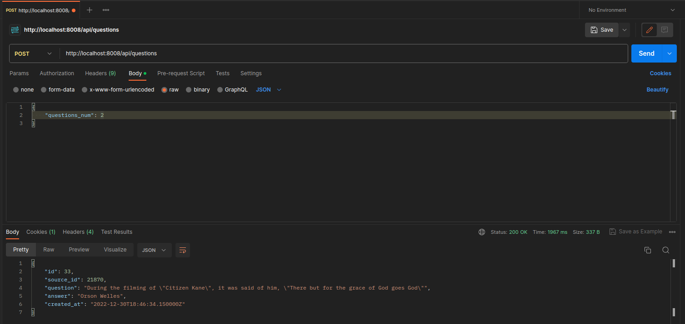
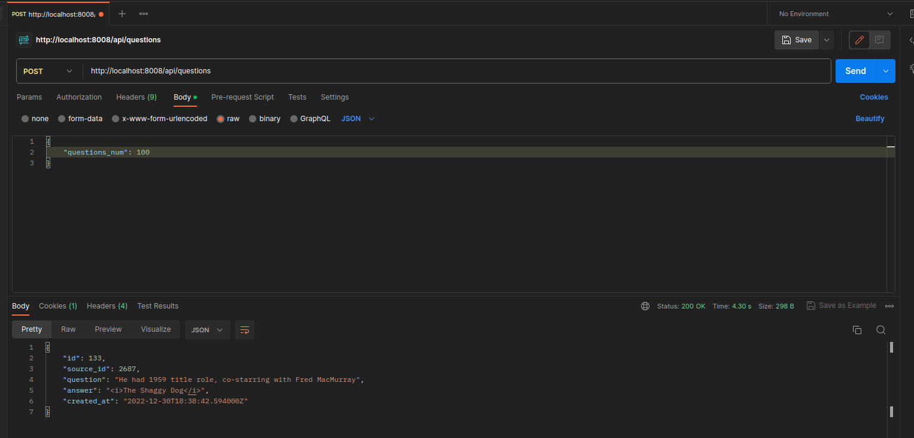

# FastApiTestCase (Junior)

[Тестовое задание Junior.pdf](%D2%E5%F1%F2%EE%E2%EE%E5%20%E7%E0%E4%E0%ED%E8%E5%20Junior.pdf)

## Используемые библиотеки/фреймворки:
- [Docker](https://www.docker.com/)
- [FastApi](https://fastapi.tiangolo.com/)
- [SQLAlchemy](https://www.sqlalchemy.org/)
- [Pydantic](https://docs.pydantic.dev/latest/)
- [PostgreSQL](https://www.postgresql.org/)

## Installation

Проверить env файл в папке app

```dotenv
PUBLIC_HOST=localhost   # Хост нашего сервера
PUBLIC_PORT=8008        # Публичный порт (Необхоимо указать так же в docker compose)
DATABASE=postgresql+asyncpg # БД PostgreSQL + асинхронная зависимость
DATABASE_NAME=fastapi   # Имя нашей бд (Необхоимо указать так же в docker compose)
DATABASE_USER=fastapi_secure_user # Пользователь нашей бд (Необхоимо указать так же в docker compose)
DATABASE_PASSWORD=dj_PG!p_s(99)*74_pR_oP # Пароль нашей бд (Необхоимо указать так же в docker compose)
DATABASE_HOST=db        # Хост нашей бд
DATABASE_PORT=5432      # Локальный порт нашей БД внутри Docker
```

Проверить docker compose файл

```yaml
# Сделал БД локальную, к которой может подключиться только наш FastApi сервис в целях безопасности
# если необходимо подключиться из-вне, требуется указать 
# ports: "0000:5432", в сервисе db, где 0000 это внешний порт 

version: '3.9'

services:
  web:
    build: .
    command: uvicorn app.main:app --host 0.0.0.0
    ports:
      - "8008:8000" # Поменять 8008 на тот который указан в .env
    volumes:
      - .:/app
    env_file:
      - app/.env
    depends_on:
      - db

  db:
    image: postgres
    container_name: fastapi_db
    environment:
      POSTGRES_DB: fastapi
      POSTGRES_USER: fastapi_secure_user
      POSTGRES_PASSWORD: dj_PG!p_s(99)*74_pR_oP
      PGDATA: /var/lib/postgresql/data/pgdata
    volumes:
      - /opt/pgsql:/var/lib/postgresql/data
    healthcheck:
      test: [ "CMD-SHELL", "pg_isready -U fastapi_secure_user -d fastapi" ]
      interval: 10s
      timeout: 5s
      retries: 5
      start_period: 10s
    restart: always
    deploy:
      resources:
        limits:
          cpus: '1'
          memory: 4G

volumes:
  postgres_data:
```

## Example

### Задание 1

Для проверки REST методов буду использовать [Postman](https://www.postman.com/)

- POST метод (http://127.0.0.1:8008/api/questions) -> body {"questions_num": int}


Вернул none, потому что первая запись, предыдущего элемента ещё не существует

Добавляем ещё сто элементов


### Задание 2

- Создание пользователя

POST (http://127.0.0.1:8008/api/users/add) -> body {"name": str}


- Просмотр всех пользователей

GET (http://127.0.0.1:8008/api/users)


- Преобразование аудио из *.wav в *.mp3

POST (http://127.0.0.1:8008/api/audio/add) body -> {id: int, token: str, file: bytes | File}


